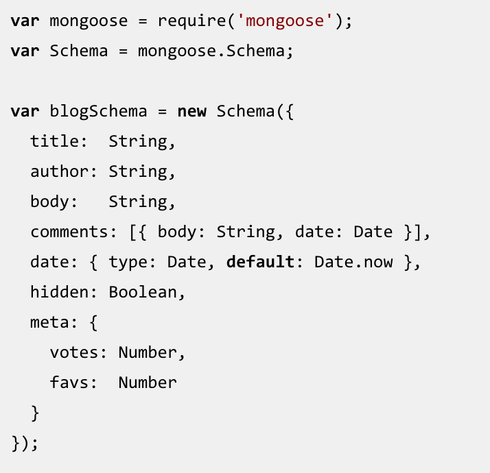

# MongoDB

## What is MongoDB?
- A NoSql Database, meaning it is not a relational database and does not use tables like SQL.
- MongoDb uses documents, which look like json objects saved on a file.

## Documents
A record in MongoDB is a document, which is a data structure composed of field and value pairs. MongoDB documents are similar to JSON objects. The values of fields may include other documents, arrays, and arrays of documents.

## Collections

MongoDB stores documents in collections. Collections are analogous to tables in relational databases. Unlike a table, however, a collection does not require its documents to have the same schema.

In MongoDB, documents stored in a collection must have a unique id field that acts as a primary key.

## Mongoose

Mongoose is an ORM that works with MongoDb.

While MongoDb does not require you to create a schema or model. Mongoose allows you to do so.

### Mongoose Schema

### Mongoose Models and Instances

## Resources
- [Mongoose Docs](http://mongoosejs.com/index.html)
- [Mongo Docs](https://www.mongodb.org/)
- [Helpful Tutorial Using Express/Node/Mongo](https://scotch.io/tutorials/using-mongoosejs-in-node-js-and-mongodb-applications)
